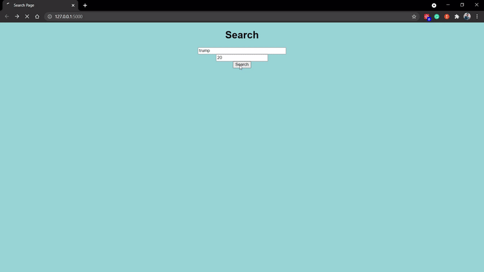

# Twitter Sentiment Analysis and Prediction


[](https://twitter-senti-pred.herokuapp.com)
<br/>

__I started this self motivated project to explore and implement tweepy, textblob, Flask, chart.js with Python.__

Try this awesome __[Real-Time Twitter Monitoring System here](https://twitter-senti-pred.herokuapp.com)__ on Heroku server. Read a series of related articles below:

## Interesting facts from exploratory data analysis
- Less 0.01% users will push tweets with their locations.
- Tweets grabbed from streaming data won't have more than 0 LIKE or RETWEET, since you have already captured them even before others press buttons :p
- More than 65.6% users will write the locations in their profile, although very few of them don't live on Earth according to that fact.
- The numbers of positive and negative tweets are relatively close and stay low compared with neural tweet number. Unless emergency events happen, lines won't fluctuate acutely.

## Quick Demo 

### Real-time Interactive Web App on Heroku server
[web app](https://twitter-senti-pred.herokuapp.com) has been deployed on Heroku.


### Real-time Twitter Sentiment Analysis in Jupyter Notebook
Try this interactive [in Jupyter Notebook](https://github.com/YogeshRajgure/Twitter_SentimentAnalysis/blob/master/walkthrough_mini_project_sem5.ipynb). To run with streaming data, you need to deploy it locally.

## Get Started

### Pre-installation
```
pip install -r requirements.txt
```
### Set-up
Create a twitter's developer account and fill in the following content
```
# Go to http://apps.twitter.com and create an app.
# The consumer key and secret will be generated for you
API_KEY = "XXXXXXXXXXXXXX"
API_SECRET_KEY = "XXXXXXXXXXXXXXXXXXXXXXXXXXXXXXXXXXXXXXXXXXXXXXXXXX"

# After the step above, you will be redirected to your app's page.
# Create an access token under the the "Your access token" section
ACCESS_TOEKN = "XXXXXXXXXXXXXXXXXXXXXXXXXXXXXXXXXXXXXXXXXXXXXXXX"
ACCESS_TOKEN_SECRET = "XXXXXXXXXXXXXXXXXXXXXXXXXXXXXXXXXXXXXXXXXXX"
```

## Challenges

Main challenge is all about how you clean your text, and how do you use it while analysis and prediction.